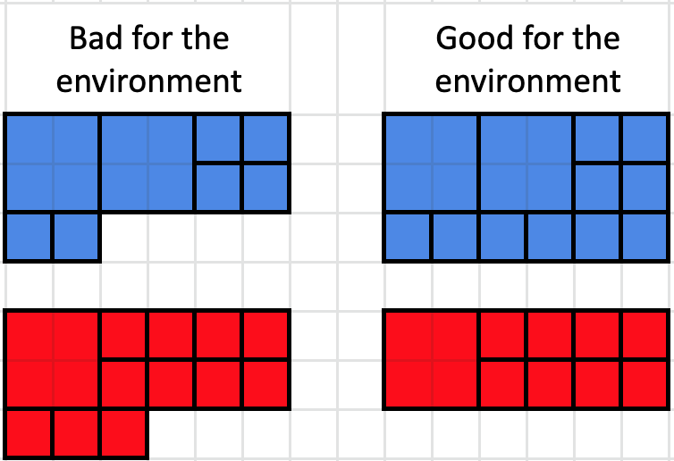

Just before placing your order at the fabric store, you realize that you might be wasting some material. In your quest to be more environmentally conscious, you want to `change the pattern so that there is as little leftover fabric as possible`. However, you also want to make sure that just like the original, you `don't have two squares of the same color touching and forming a rectangle` (corners touching are okay). In addition, you don't want to change the pattern too much, so patches can only be replaced by another patch of the same size.

For example, the bolts of fabric on the left waste four potential blue squares and three potential red squares. By changing the red squares to indigo squares (or the indigo squares to red squares), you can reduce the waste to zero.

{width=50%}

**`To calculate the maximum amount of fabric saved, find the total area of all waste eliminated.`**