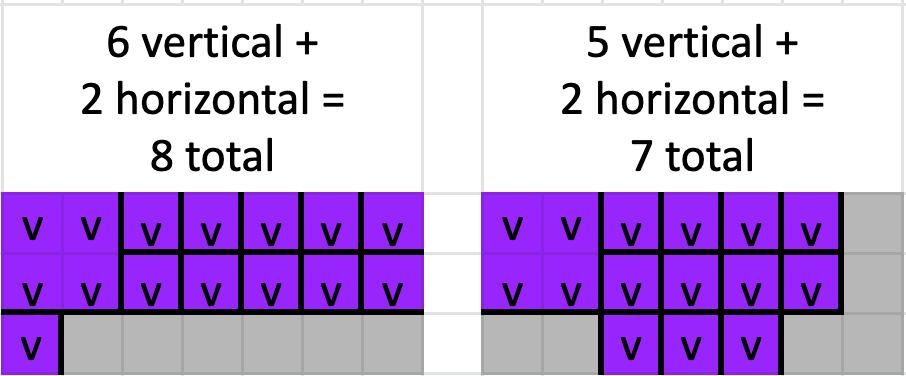

> Disclaimer: I'm not sure how this would interact with Story Part 2.5. If people export their modified input in 2.5, it could change your answer to this part.

You finally make it home with all the fabric and thread that you'll need and it's time to get to cutting. You want to make as few cuts to the fabric as possible.

For example, you could cut the following bolt of violet as described on the left. This would require 6 vertical and 2 horizontal for a total of 8 cuts. However, if you rearrange the squares to the example on the right, it requires only 5 vertical and 2 horizontal for a total of 7 cuts.

{width=75%}

**`What is the total minimum number of cuts you will need to make to your bolts of fabric?`**