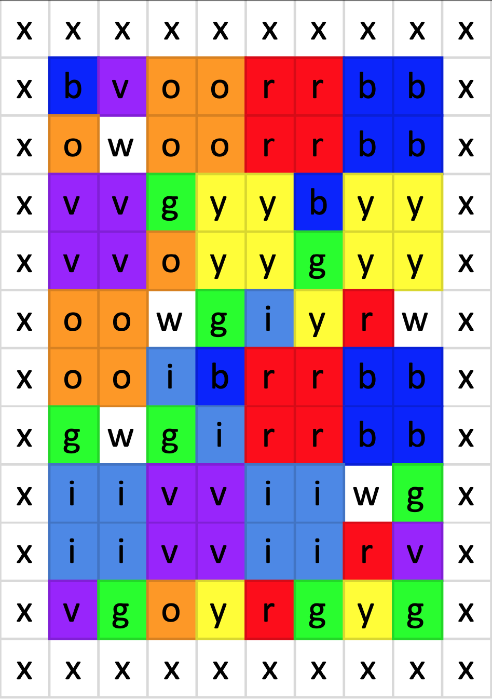
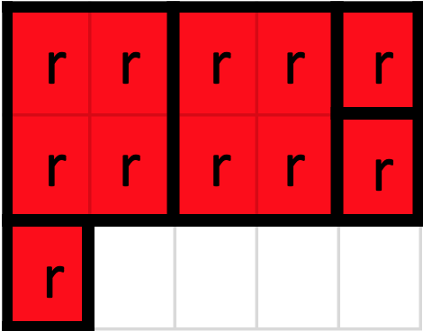

You've finally figured out how many squares of fabric you need and it is a massive amount! Having left several quilts to the last minute before, you know you won't be able to source that many squares from your local fabric store with no notice. Thankfully, they sell the colors you need by the unit in **`widths of 40 units`**. All you need to do is **`bring in the unit length needed for each color`** and they'll be able to cut the fabric to size.

{width=25%}

Using the same example input as Part 1 (but with a fabric width of 5), the red patches can be arranged into three rows like so:

{width=25%}

When you know long you want each bolt of fabric to be, you order them by telling the store your format, in this case it's `roygbiv1`, and the length of each bolt with no spaces between them. The `1` at the end lets them know that each color is using one digit (more digits may have leading zeroes). For the above example, red has a length of 3, so that's the first number, orange and yellow also have lengths of 3 (the second and third number), and so on. The final result for the example input is **`3332333`**.

Because you visit the fabric store so much, the employees know that you will be using the `roygbiv` format and all they need is the length of each bolt of fabric. While they don't know how many digits you'll be using, it shouldn't be hard for them to figure it out so long as each color has the same number of digits. **`What is the number that will tell them how long to cut each bolt?`**